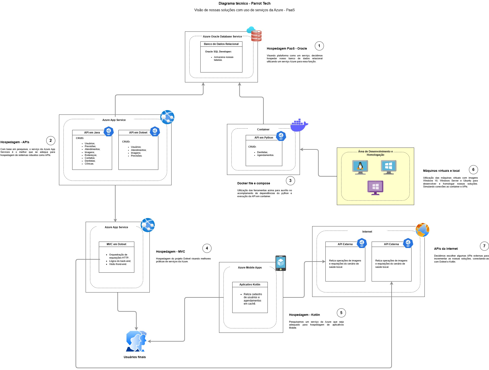

# Challenge - Sprint 2 - Parrot Tech


> Nosso app criado em python realiza um CRUD em nossas tabelas, com o uso de Dockerfile e docker-compose.

## 🎬 Demonstração

[](https://www.youtube.com/watch?v=5cYDJFRhW3c)

Clique na imagem acima para assistir à demonstração do projeto no YouTube!

## 🖇️ Diagrama



## 📝 Sobre o Projeto

O projeto visa atender os critérios da máteria de DevOps, com uso de uma aplicação que implementa as ferramentas do Docker e VMs do Azure.

## 🚀 Instalação

Passo a passo para instalar o projeto localmente.

```bash
# Clone o repositório
git clone https://github.com/caioedum/challenge-devops-sprint2.git
```
```bash
# Acesse o diretório do projeto
cd challenge-devops-sprint2
```
```bash
# Execute com o comando no terminal
docker-compose up --build
```

### 👥 Integrantes

- **Nome e RM**: Caio Martins - RM554025
- **Nome e RM**: Julia Mariano - RM552713
- **Nome e RM**: Leonardo Gaspar - RM553383

